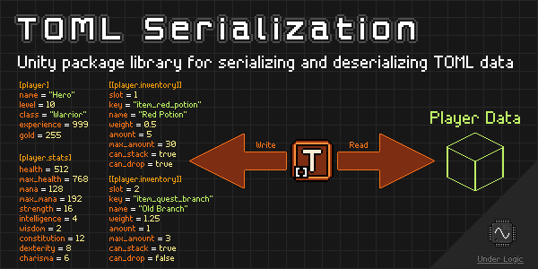

# Overview

Unity package library for serializing and deserializing [TOML](https://toml.io/en/) data.

**NOTE:** This package is still in development and may have breaking changes in future versions until a stable v1.0.0 release is made.

## What is TOML?

[TOML](https://toml.io/en/) is a relatively newer file format, similar to JSON and YAML files, used for storing data in a human-readable format.

## Why use TOML?

- Simple and straightforward format.
- Easy to read and write, especially for humans.
- Less overhead and control characters than JSON.
- Supports comments.

## Why use this package?

While there are various TOML libraries available for .NET, this package aims to provide a simple and easy to use API for serializing and deserializing TOML data in Unity.

It aims to provide a familiar API to Unity's [`JsonUtility`](https://docs.unity3d.com/ScriptReference/JsonUtility.html) API for serializing and deserializing JSON data.
Additionally, it provides ways to customize the serialization process via [attributes](attributes.md) similar to those in Microsoft's [`System.Text.Json`](https://learn.microsoft.com/en-us/dotnet/api/system.text.json.serialization?view=net-7.0) namespace.

It is also highly tested with 90%+ code coverage in the [`TomlSerializer`](serialization/toml-serializer.md), with over 600 unit tests.

## Compatibility

This package is compatible with Unity 2019.4 and newer, it only uses C# 7.0 features for maximum compatibility.

## Limitations

While this package does implement most of the TOML 1.0 specification, it is **not** intended to support every aspect of the specification..
It is intended to provide a simple, easy-to-use, and performant library for serializing and deserializing objects to and from TOML format for the majority of use cases.

That means when importing TOML files generated by other libraries or programs, there may be some issues with deserialization.
However, if you are using this library to generate TOML files, you should not have any issues.
