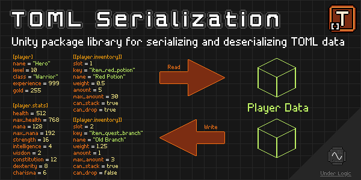

# TOML Serialization

[](https://openupm.com/packages/com.underlogic.toml-serialization/)



Unity package library for serializing and deserializing [TOML](https://toml.io/en/) data.

:exclamation: **This repository is no longer maintained.** :exclamation:

## Motivation

Unity does not have built-in support for TOML files and many existing libraries are not compatible with Unity.

Wouldn't it be nice if you could serialize and deserialize TOML data in Unity, similar to the built-in `JsonUtility`?
While also having the ability to tune the serialization process to your needs? That's what this package is for.

This library is designed to be a cross between Unity's `JsonUtility` and Microsoft's `System.Text.Json` libraries in terms of functionality and ease of use.

## Limitations

This library is **not** intended to support the full TOML 1.0 specification.
It is designed to support the most common use cases for serializing and deserializing data.

While it does aim to support all of the TOML data types, including nested tables, it does not support all of the TOML syntax (namely, dotted keys).

This means that TOML files generated by other libraries with more complex notation _may_ not be compatible with this library.

However, any TOML file generated by this library _should_ be compatible with other TOML libraries (and itself).

## Installation

The package library can be installed to your Unity project in the following ways:

- Using [OpenUPM](https://openupm.com/) package manager
  - `openupm add com.underlogic.toml-serialization`
- Clone the repository and adding it as a local package
- Add the package by git URL

Installing it by git URL allows the package to be updated when new releases are available here.

## Documentation

[Online documentation](https://underlogic.github.io/toml-serialization/) is automatically published to GitHub Pages.

Offline docs can be found in the [`Documentation~`](./Documentation~) folder, and can be viewed via [`mdbook`](https://rust-lang.github.io/mdBook/index.html):

```shell
$ mdbook serve ./Documentation~ --open
```

## Samples

The package library includes several sample scenes that demonstrate how to serialize and deserialize data.
It is highly recommended that you import the samples so you can see the library in action and experiment with it.

## Contributing

To make working on the library easier while keeping this repository minimal, it is recommended to create a separate Unity project, (i.e. `toml-serialization-project`).

Then link the following folders into the Unity project for easy editing/syncing while keeping code completion and intellisense:

```shell
$ cd toml-serialization-project/Assets
$ ln -s ~/toml-serialization/Samples~ Samples

$ mkdir -p Scripts && cd Scripts
$ ln -s ~/toml-serialization/Editor
$ ln -s ~/toml-serialization/Runtime
$ ln -s ~/toml-serialization/Tests
```

**NOTE:** This assumes both folders are in your `$HOME` folder. Adjust paths accordingly if they differ.

Now you can work in the shell project without copying files back and forth, and also generating `.meta` files automatically.
